# Argus Gym Showcase

**Argus Gym** es una aplicación fitness/social construida como producto full stack: permite planificar entrenamientos, crear rutinas, ejecutar sesiones en vivo, registrar progreso, publicar contenido, descubrir rutinas de otros usuarios, chatear, trabajar con un modo coach/alumno y administrar la plataforma desde un panel interno.

Demo actual: **https://argusgym.vercel.app/**

Este repositorio es un **showcase público**. No contiene el código fuente principal. El proyecto real sigue siendo privado porque incluye configuración sensible, autenticación, despliegue, integraciones, datos de prueba y lógica interna del producto. Aquí se documentan el alcance, la arquitectura, las funcionalidades, las decisiones técnicas y las capturas del producto.

---

## Qué se puede hacer en Argus Gym

Argus Gym está pensado como una app fitness moderna, mobile-first y con capa social. No es solo un CRUD de rutinas: intenta cubrir el flujo completo de una persona que entrena y quiere organizar su progreso.

### 1. Entrar, registrarse y configurar la cuenta

La app incluye un flujo de acceso con login, registro, recuperación de contraseña, verificación de email, sesiones activas y Google OAuth. La idea es que el usuario pueda entrar de forma segura, gestionar su cuenta y mantener sesiones reales entre dispositivos.

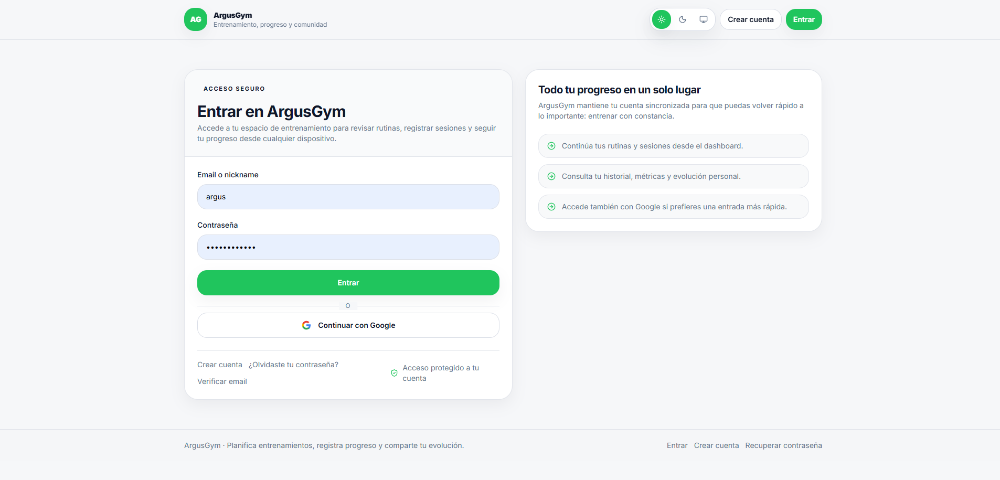

### 2. Usar un dashboard privado

El dashboard funciona como punto de entrada después del login. Resume el estado del usuario y conecta con las acciones principales: calendario, sesiones, rutinas, comunidad, perfil y configuración. La intención es que el usuario no tenga que “buscar” qué hacer cada día.

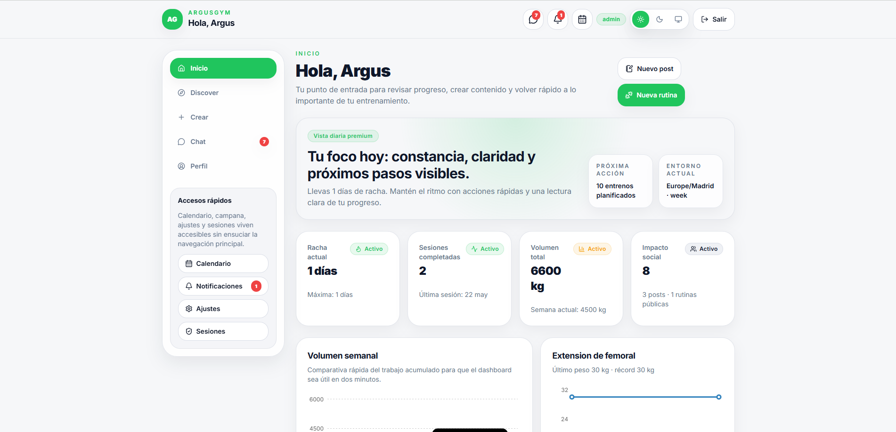

### 3. Planificar entrenamientos en calendario

El calendario permite organizar rutinas por día, revisar próximas sesiones y mantener una visión clara de la planificación. Esta parte es clave porque convierte las rutinas en un hábito semanal, no en elementos sueltos.

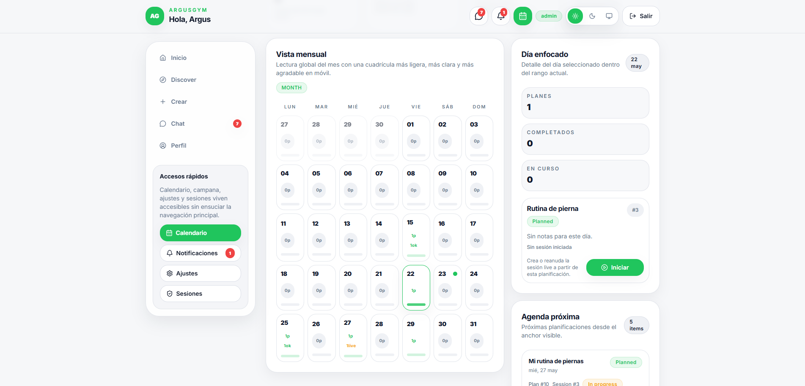

### 4. Ejecutar un entrenamiento en vivo

El modo live permite seguir una sesión mientras se entrena. Incluye ejercicios, series, repeticiones, pesos, descansos, notas y estado de la sesión. Está pensado para usarse en el gimnasio de forma rápida, sin perder tiempo navegando por formularios largos.

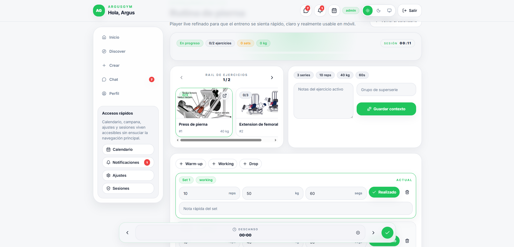

### 5. Crear contenido desde Studio

Studio es el centro de creación. Desde ahí se pueden preparar publicaciones, rutinas y ejercicios mediante flujos guiados. El enfoque es evitar formularios enormes y sustituirlos por wizards más claros, con media, preview, borradores y protección ante cambios sin guardar.

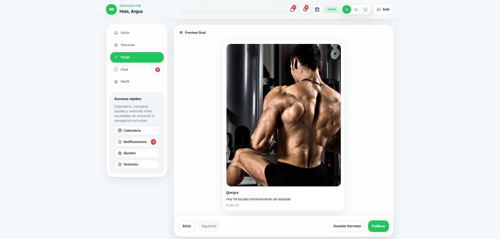

### 6. Descubrir contenido de la comunidad

La parte social permite descubrir publicaciones, rutinas y ejercicios públicos. El usuario puede explorar contenido, ver perfiles, guardar elementos, interactuar y reutilizar ideas para su propio entrenamiento.

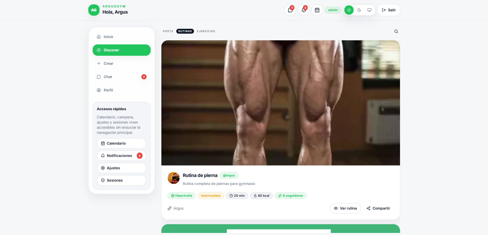

### 7. Gestionar perfil y presencia pública

El perfil reúne información del usuario, contenido publicado, rutinas y actividad visible. La app diferencia entre perfil privado y perfil público para que la experiencia sea útil tanto para seguimiento personal como para compartir contenido con otros.

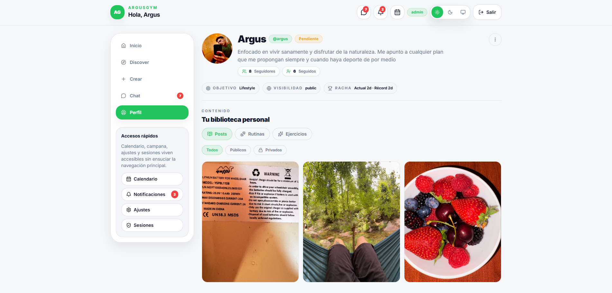

### 8. Chatear con otros usuarios

Argus Gym incluye conversaciones privadas, mensajes, adjuntos y estados relacionados con notificaciones. Esta parte prepara la base para interacción social real y para comunicación coach/alumno.

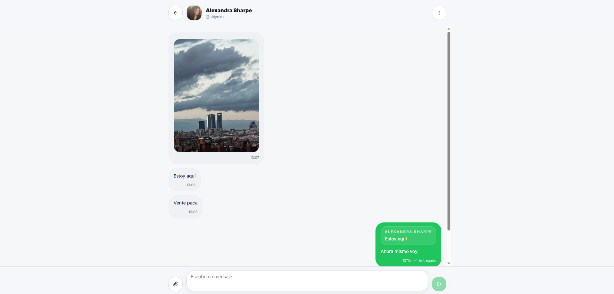

### 9. Usar modo coach

El modo coach permite trabajar con alumnos: roster, ficha de alumno, asignaciones, check-ins y seguimiento. La idea es que la app no sea solo para usuarios individuales, sino también para entrenadores que quieran gestionar personas y rutinas.

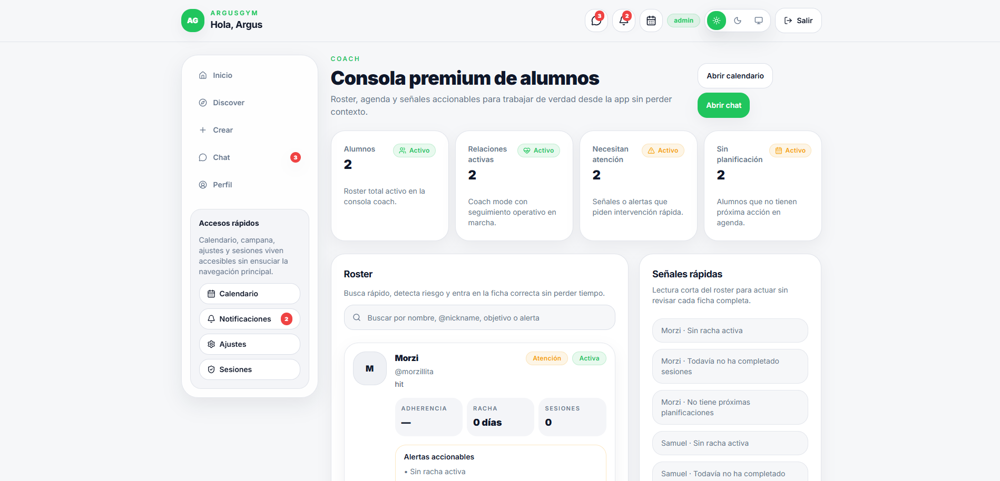

### 10. Administrar y observar el producto

El panel admin permite revisar métricas, reportes, auditoría y actividad interna. Esta parte demuestra que el proyecto está pensado como producto mantenible, no solo como interfaz para usuarios finales.

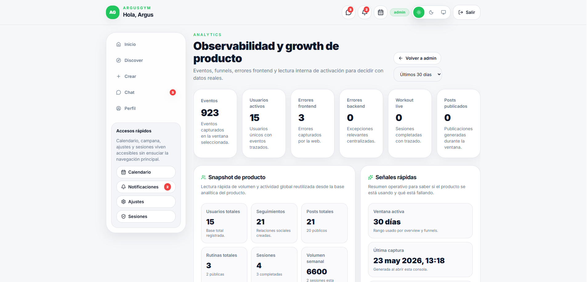

### 11. Ajustar seguridad y preferencias

La sección de settings permite gestionar cuenta, preferencias, seguridad, sesiones y otros datos del usuario. Esta capa es importante para una app con auth real y uso continuado.

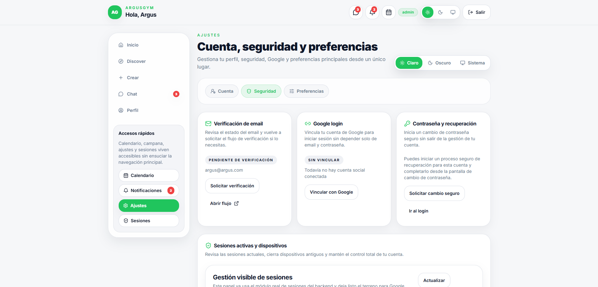

### 12. Usarlo en móvil

El proyecto se ha trabajado con enfoque mobile-first. La experiencia móvil es importante porque una app fitness se consulta muchas veces desde el gimnasio, no solo desde escritorio.

  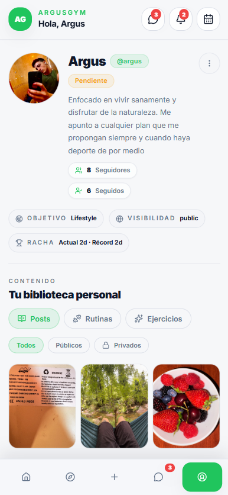
  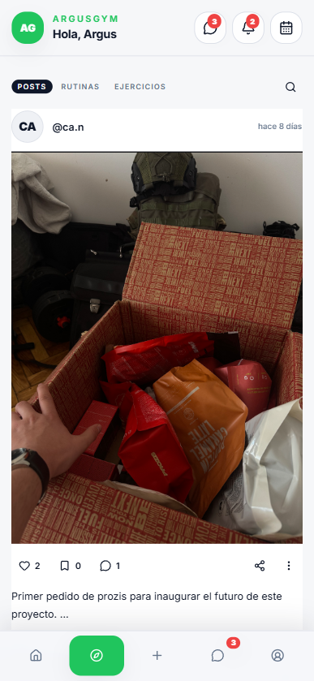

---

## Estado actual

Argus Gym ha pasado por varias iteraciones y actualmente tiene una base avanzada de producto web:

- backend con FastAPI, SQLAlchemy, Alembic y Pydantic;
- base de datos relacional;
- frontend web con Next.js, React y TypeScript;
- autenticación real y sesiones;
- integración de media;
- calendario y planificación;
- workout live mode;
- studio de creación;
- comunidad, perfiles, likes, guardados y comentarios;
- chat y notificaciones;
- coach mode;
- panel admin;
- analytics y observabilidad básica.

La demo actual está desplegada en Vercel/Render. Más adelante se valorará si migrarla al VPS principal junto al portfolio y otros proyectos.

---

## Stack principal

| Área | Tecnologías |
|---|---|
| Backend | Python, FastAPI, SQLAlchemy, Alembic, Pydantic |
| Base de datos | PostgreSQL |
| Frontend | Next.js, React, TypeScript, Tailwind |
| Media | Cloudinary / proveedor externo de media |
| Auth | Sesiones, refresh tokens, verificación email, reset password, Google OAuth |
| Producto | Calendario, studio, comunidad, chat, coach mode, admin, analytics |
| Despliegue actual | Frontend en Vercel + backend en Render |
| Demo | https://argusgym.vercel.app/ |
| Despliegue futuro opcional | VPS Linux, Docker, reverse proxy, HTTPS, backups |

---

## Arquitectura resumida

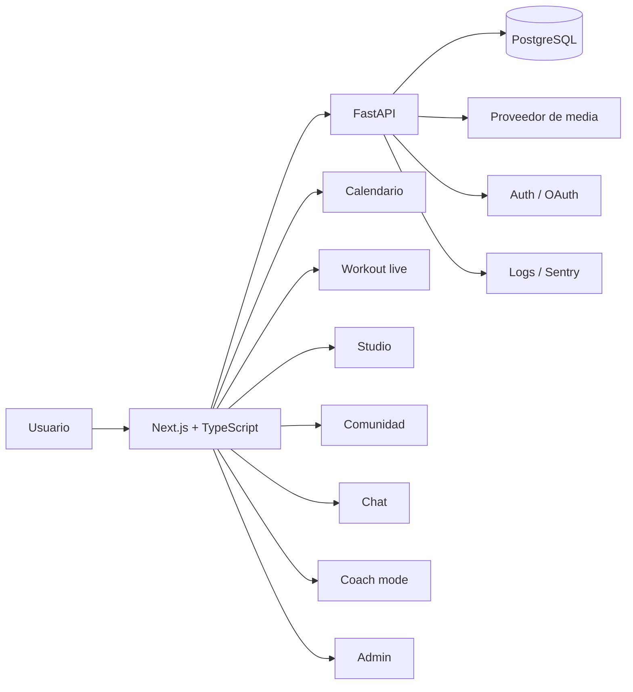

Más detalle en [`docs/architecture.md`](docs/architecture.md).

---

## Capturas

Las capturas del showcase están en [`assets/screenshots`](assets/screenshots). También hay una explicación más completa en [`docs/screenshots.md`](docs/screenshots.md).

| Sección | Captura | Qué enseña |
|---|---|---|
| Landing | `01-public-home.png` | Página pública y propuesta del producto |
| Login | `02-auth-login.png` | Acceso, auth y entrada a la app |
| Dashboard | `03-dashboard.png` | Resumen privado y navegación principal |
| Calendario | `04-calendar.png` | Planificación semanal/diaria |
| Workout live | `05-workout-live.png` | Ejecución real de entrenamiento |
| Studio | `06-studio.png` | Creación de posts, rutinas y ejercicios |
| Comunidad | `07-community-discover.png` | Feed, discover y contenido público |
| Perfil | `08-profile.png` | Identidad pública/privada y actividad |
| Chat | `09-chat.png` | Conversaciones y comunicación |
| Coach | `10-coach-mode.png` | Gestión coach/alumno |
| Admin | `11-admin-analytics.png` | Métricas internas y control del producto |
| Settings | `12-settings-security.png` | Cuenta, seguridad y preferencias |
| Móvil | `13-mobile-profile.png`, `14-mobile-discover.png` | Experiencia responsive/mobile-first |

---

## Por qué el código es privado

El código principal no se publica porque el proyecto incluye partes sensibles: autenticación, sesiones, configuración, integraciones, almacenamiento, despliegue y datos internos. Este repositorio existe para enseñar el producto de forma segura: capturas, arquitectura, funcionalidades, decisiones técnicas y demo.

---

## Documentación

- [`docs/case-study.md`](docs/case-study.md)
- [`docs/features.md`](docs/features.md)
- [`docs/architecture.md`](docs/architecture.md)
- [`docs/product-flow.md`](docs/product-flow.md)
- [`docs/technical-decisions.md`](docs/technical-decisions.md)
- [`docs/privacy-and-demo-data.md`](docs/privacy-and-demo-data.md)
- [`docs/deployment.md`](docs/deployment.md)
- [`docs/screenshots.md`](docs/screenshots.md)
- [`docs/roadmap.md`](docs/roadmap.md)

---

## Qué demuestra este proyecto

Argus Gym demuestra capacidad para construir un producto full stack grande y coherente:

- diseño de dominio;
- backend API;
- autenticación real;
- base de datos relacional;
- migraciones;
- frontend moderno;
- UX mobile-first;
- flujos largos de producto;
- media;
- comunicación entre usuarios;
- roles y permisos;
- panel interno;
- despliegue y operación futura.

---

## Autor

**Alessandro Staiano**  
Desarrollador web junior orientado a backend, producto y datos.

GitHub: [github.com/alessandrostfr](https://github.com/alessandrostfr)  
LinkedIn: [linkedin.com/in/alessandrostfr](https://www.linkedin.com/in/alessandrostfr)
