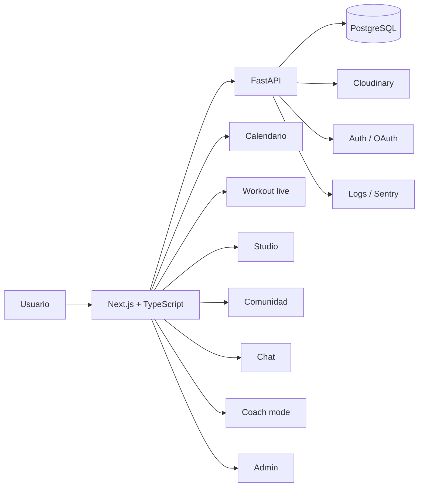

# Argus Gym Showcase

**Argus Gym** es una aplicación fitness/social construida como producto full stack: rutinas, calendario, entrenamiento en vivo, progreso, perfiles, comunidad, chat, coach mode y panel interno de administración.

Este repositorio es un **showcase público**. No contiene el código fuente principal.

El proyecto real se mantiene privado porque incluye configuración sensible, lógica de autenticación, almacenamiento, datos de prueba, integración de media, despliegue y partes internas del producto. Aquí se documenta lo importante para entender qué se ha construido, cómo está pensado y qué demuestra técnicamente.

---

## Qué problema intenta resolver

Muchas apps fitness se quedan en una de dos cosas:

- un simple registro de entrenamientos;
- o una red social donde el entrenamiento real queda en segundo plano.

Argus Gym intenta unir ambas ideas: una experiencia donde el usuario pueda planificar, entrenar, registrar progreso y compartir contenido, pero sin perder de vista que el flujo principal debe ser útil en el gimnasio.

---

## Estado actual

El proyecto ha evolucionado por versiones y actualmente está en una fase avanzada de producto web:

- backend FastAPI consolidado;
- base de datos relacional con migraciones;
- frontend web moderno con Next.js y TypeScript;
- autenticación real;
- media real;
- módulos sociales;
- calendario;
- workout live mode;
- chat;
- coach mode;
- panel admin;
- analytics internas;
- enfoque mobile-first.

Ya existe una demo web desplegada para revisión inicial: **https://argusgym.vercel.app/**.

Quedan pendientes capturas finales, poblar/limpiar datos demo y, si se decide más adelante, migrar el despliegue a VPS para tener una infraestructura común con el portfolio y el resto de proyectos.

---

## Stack principal

| Área | Tecnologías |
|---|---|
| Backend | Python, FastAPI, SQLAlchemy, Alembic, Pydantic |
| Base de datos | PostgreSQL |
| Frontend | Next.js, React, TypeScript, Tailwind |
| Media | Cloudinary / proveedor externo de media |
| Auth | Sesiones, refresh tokens, verificación email, reset password, Google OAuth |
| Producto | Calendario, studio, comunidad, chat, coach mode, admin, analytics |
| Despliegue actual | Frontend en Vercel + backend en Render |
| Demo | https://argusgym.vercel.app/ |
| Despliegue futuro opcional | VPS Linux, Docker, reverse proxy, HTTPS, backups |

---

## Funcionalidades principales

### Entrenamiento

- planificación de rutinas en calendario;
- sesiones de entrenamiento en vivo;
- registro set a set;
- temporizador de descanso;
- notas por ejercicio;
- historial y progreso;
- sugerencia de último peso usado.

### Studio

- creación de posts;
- creación de rutinas;
- creación de ejercicios;
- wizards por pasos;
- subida y recorte de imágenes;
- borradores;
- autosave;
- preview antes de publicar.

### Comunidad

- feed social;
- publicaciones;
- rutinas compartidas;
- ejercicios públicos;
- perfiles públicos;
- likes, guardados y comentarios;
- navegación discover.

### Coach mode

- relación coach/alumno;
- roster de alumnos;
- ficha de alumno;
- asignación de rutinas;
- check-ins;
- seguimiento de adherencia.

### Chat y notificaciones

- conversaciones privadas;
- mensajes;
- adjuntos;
- notificaciones;
- eventos en tiempo real.

### Admin y observabilidad

- panel interno;
- reportes;
- moderación;
- auditoría;
- métricas de producto;
- funnels internos;
- logs estructurados;
- integración opcional con Sentry.

---

## Arquitectura resumida

Más detalle en [`docs/architecture.md`](docs/architecture.md).

---

## Demo y capturas

Demo actual: **https://argusgym.vercel.app/**

La demo se tratará como entorno de presentación/staging. Antes de usarla como enlace principal en portfolio, hay que revisar datos visibles, crear usuarios ficticios y añadir capturas limpias.

Capturas que se añadirán:

- dashboard;
- calendario;
- entrenamiento en vivo;
- studio;
- perfil público;
- comunidad/discover;
- chat;
- coach mode;
- admin.

Ver checklist en [`docs/screenshots.md`](docs/screenshots.md).

---

## Por qué el código es privado

El código principal no se publica por varios motivos:

- contiene configuración sensible;
- incluye integración real de autenticación y media;
- maneja datos de usuarios, sesiones y contenido;
- el proyecto se usa como producto en evolución;
- la demo pública debe funcionar con datos ficticios o datos sanitizados.

Aun así, este showcase permite revisar el alcance, arquitectura, decisiones técnicas, flujo de producto y roadmap.

---

## Documentación

- [`docs/case-study.md`](docs/case-study.md)
- [`docs/features.md`](docs/features.md)
- [`docs/architecture.md`](docs/architecture.md)
- [`docs/product-flow.md`](docs/product-flow.md)
- [`docs/technical-decisions.md`](docs/technical-decisions.md)
- [`docs/privacy-and-demo-data.md`](docs/privacy-and-demo-data.md)
- [`docs/deployment.md`](docs/deployment.md)
- [`docs/screenshots.md`](docs/screenshots.md)
- [`docs/roadmap.md`](docs/roadmap.md)

---

## Qué demuestra este proyecto

Argus Gym demuestra trabajo sobre un producto grande, no una demo aislada:

- diseño de dominio;
- backend API;
- autenticación real;
- base de datos relacional;
- migraciones;
- frontend moderno;
- UX mobile-first;
- flujos largos de producto;
- media;
- comunicación entre usuarios;
- roles y permisos;
- panel interno;
- despliegue y operación futura.

---

## Autor

**Alessandro Staiano**  
Desarrollador web junior orientado a backend, producto y datos.

GitHub: [github.com/alessandrostfr](https://github.com/alessandrostfr)  
LinkedIn: [linkedin.com/in/alessandrostfr](https://www.linkedin.com/in/alessandrostfr)
