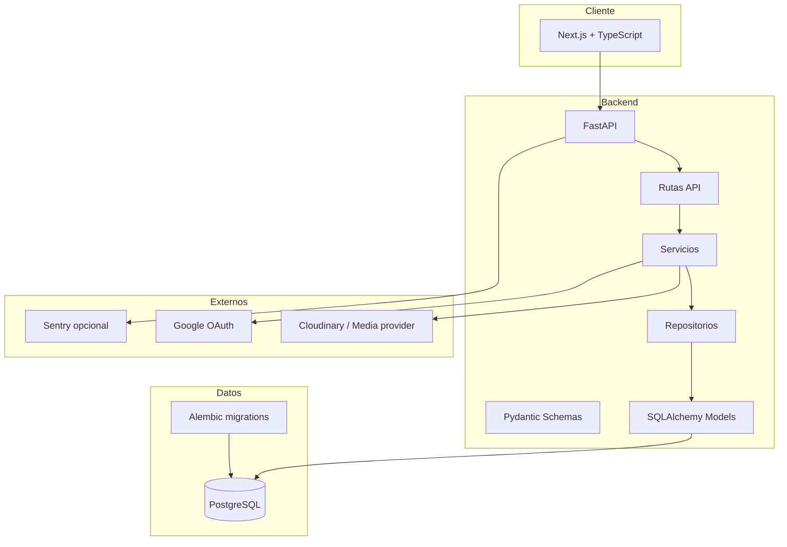

# Arquitectura

## Visión general

Argus Gym está planteado como una aplicación full stack con separación clara entre backend, frontend, base de datos y servicios externos.



---

## Backend

El backend sigue una estructura por capas:

- `app/api`: endpoints.
- `app/schemas`: contratos Pydantic.
- `app/models`: modelos ORM.
- `app/repositories`: acceso a datos.
- `app/services`: lógica de negocio.
- `app/core`: configuración, seguridad, observabilidad y utilidades.
- `alembic`: migraciones.

La intención es evitar que los endpoints acumulen lógica y mantener cada dominio con responsabilidades claras.

---

## Frontend

La dirección actual del frontend es Next.js + TypeScript.

Estructura principal:

- `web/src/app`: rutas.
- `web/src/components`: componentes reutilizables.
- `web/src/lib`: clientes, helpers y contratos.
- `web/src/types`: tipos auxiliares.

El diseño busca ser mobile-first, con navegación clara y pantallas más cercanas a producto que a prototipo.

---

## Base de datos

La base de datos principal para despliegue es PostgreSQL.

Dominios persistidos:

- usuarios;
- perfiles;
- preferencias;
- sesiones de auth;
- tokens de acción;
- ejercicios;
- workouts;
- planificación;
- sesiones de entrenamiento;
- posts;
- comentarios;
- likes;
- guardados;
- media;
- chat;
- notificaciones;
- coach mode;
- admin;
- analytics.

---

## Servicios externos

### Cloudinary / media provider

Usado para subir y servir imágenes de avatar, posts, rutinas, ejercicios y adjuntos.

### Google OAuth

Permite login social y vinculación segura de cuenta.

### Sentry

Preparado como integración opcional para errores y trazas.

---

## Despliegue objetivo

El despliegue previsto para portfolio será en VPS:

```text
Nginx / reverse proxy
Docker Compose
Frontend Next.js
Backend FastAPI
PostgreSQL
Media provider externo
HTTPS
Backups
Monitorización básica
```

---

## Motivo de mantener el código privado

El repositorio real incluye código, configuración y flujos internos que no conviene exponer públicamente. Este showcase documenta el producto sin publicar credenciales, lógica sensible ni datos.
