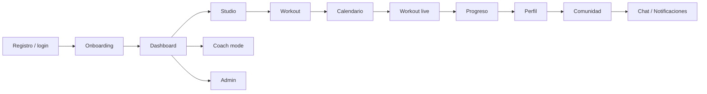

# Flujo de producto

## 1. Entrada y activación

El usuario llega a la landing, se registra o inicia sesión, completa onboarding y llega al dashboard privado.

Objetivo: que el usuario entienda rápido qué puede hacer y tenga acciones claras.

---

## 2. Crear contenido

Desde Studio puede crear:

- una publicación;
- una rutina;
- un ejercicio.

Los wizards reducen formularios largos y permiten guardar borradores.

---

## 3. Planificar entrenamiento

Una rutina puede planificarse en calendario. La idea es que la app no se quede en “crear rutinas”, sino que acompañe la ejecución real.

---

## 4. Entrenar en vivo

Desde una planificación se puede iniciar una sesión live.

Durante la sesión:

- se registra cada set;
- se guardan reps, peso y descanso;
- se añaden notas;
- se usa temporizador;
- se cierra la sesión con resumen.

---

## 5. Ver progreso

La actividad alimenta dashboard, perfil y métricas de progreso.

---

## 6. Compartir

El usuario puede publicar contenido, mostrar rutinas, interactuar con publicaciones y descubrir perfiles.

---

## 7. Coach mode

Un coach puede gestionar alumnos, revisar información y asignar rutinas o check-ins.

---

## 8. Operación interna

El admin puede revisar recursos, reportes, auditoría y métricas.

---

## Flujo resumido

