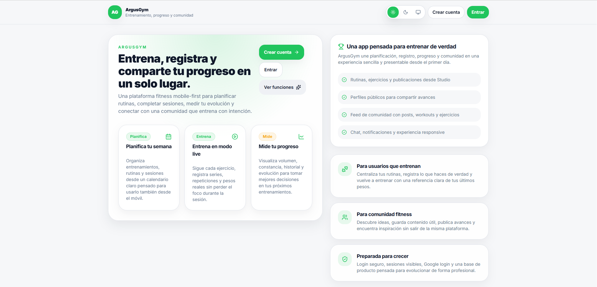

# Capturas de Argus Gym

Esta carpeta documenta qué muestra cada captura del showcase. Todas las imágenes deben estar sanitizadas: usuarios demo, emails falsos, datos ficticios y sin tokens, logs ni información privada.

## Galería principal

### 01 · Landing pública

Muestra la entrada pública al producto. Sirve para enseñar que Argus Gym tiene una presentación de producto y no es solo una colección de endpoints.

### 02 · Login / acceso

Muestra el acceso a la app. Esta sección comunica que existe un flujo de autenticación real: login, registro, recuperación de contraseña, verificación y Google OAuth si está activo.

### 03 · Dashboard privado

Es la pantalla de inicio del usuario autenticado. Resume acciones principales, métricas y acceso rápido a calendario, sesiones, perfil, comunidad y creación de contenido.

### 04 · Calendario

Representa la planificación de entrenamientos. El objetivo es que el usuario pueda organizar rutinas por días y tener una vista clara de su semana de entrenamiento.

### 05 · Workout live

Es una de las capturas más importantes. Enseña la ejecución real de un entrenamiento: ejercicios, series, repeticiones, pesos, descanso y notas durante la sesión.

### 06 · Studio

Studio centraliza la creación de contenido. Desde aquí se preparan posts, rutinas y ejercicios mediante wizards, media, previews, borradores y protección ante cambios sin guardar.

### 07 · Comunidad / Discover

Muestra la capa social: discover, publicaciones, rutinas, ejercicios públicos e interacción con contenido de otros usuarios.

### 08 · Perfil

Explica cómo se representa la identidad del usuario dentro de la app: avatar, actividad, contenido, perfil público/privado y navegación personal.

### 09 · Chat

Muestra las conversaciones privadas y prepara el contexto para interacción social y comunicación coach/alumno.

### 10 · Coach mode

Enseña el módulo para entrenadores: roster, ficha de alumno, asignaciones, check-ins y seguimiento. Es una de las partes que diferencia a Argus Gym de una app básica de rutinas.

### 11 · Admin / analytics

Muestra que el proyecto incluye una capa interna de operación: métricas, reportes, auditoría, moderación y observabilidad básica.

### 12 · Settings / seguridad

Documenta la gestión de cuenta, preferencias, seguridad y sesiones. Refuerza que la app está pensada para uso real y no solo para una demo rápida.

## Capturas móviles

  
  

Estas capturas muestran el enfoque mobile-first. En una app fitness, la experiencia móvil es clave porque muchos usuarios la consultarían durante el entrenamiento.

## Reglas de mantenimiento

- Las capturas deben usar datos ficticios o sanitizados.
- No deben aparecer emails reales, tokens, errores, logs o datos privados.
- Cada imagen debe tener un nombre estable para no romper enlaces del README.
- Si cambia la UI principal, conviene actualizar al menos dashboard, calendario, workout live, studio y móvil.
